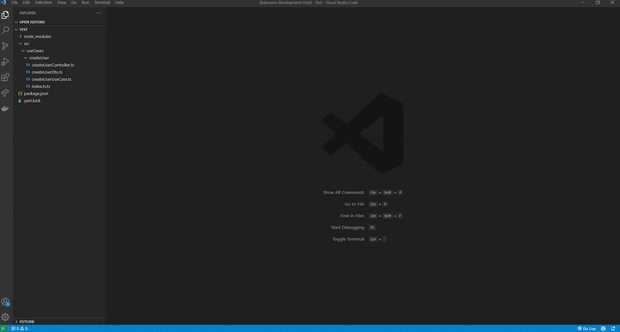

# Create Express Use Case Boilerplate

A [Visual Studio Code](https://vscode.dev/) extension that helps save time when building projects that utilize the use case pattern.

## Features

You can select "New UseCase..." from the explorer context menu to generate your use case boilerplate given the name, separating each word by spaces.

  

## Extension Settings

* `createusecase.folderCaseStyle`: define the casing style to be used when generating the folder.
* `createusecase.fileCaseStyle`: define the casing style to be used when generating the files.
* `createusecase.shouldDotFiles`: determines whether the files should be created with a dot separating the name from the type. *Example: `useCaseName.controller.ts` or `useCaseNameController.ts`*
* `createusecase.ignoreWordCountWarning`: Ignores the word count warning when generating an use case with a word count of 1.

